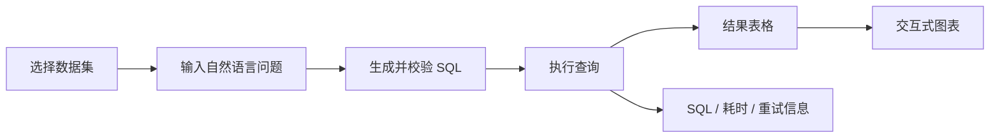

# DataQuery Copilot 前端展示页面制作方案

## 1. 项目目标

前端不是单纯的项目介绍页，而是一套可现场操作的数据查询工作台。访客应能在 3 分钟内完成以下体验：

1. 查看当前数据集、表结构和数据质量概况。
2. 用自然语言提出数据问题。
3. 看到 LLM 生成的 SQL、安全校验和自动修正结果。
4. 查看结果表格、图表和执行元信息。
5. 理解项目在缓存、日志、重试和数据清洗方面的工程能力。

首版面向作品集展示和技术面试，优先使用仓库已有的 `orders` 示例数据。文件上传、多数据库连接和用户系统延后实现。

## 2. 核心体验路径



## 3. 技术架构

| 层级 | 技术 | 职责 |
|---|---|---|
| 前端 | React + TypeScript + Vite | 工作台界面与交互状态 |
| 样式 | CSS Modules 或 Tailwind CSS | 设计令牌、响应式布局和组件状态 |
| 图表 | Chart.js | 根据结构化查询结果绘制交互式图表 |
| 表格 | TanStack Table | 排序、分页和结果浏览 |
| API | FastAPI | 将现有 Python 能力转换为 HTTP 接口 |
| 业务层 | 现有 `src/` 模块 | 数据加载、LLM、查询、清洗和校验 |
| 数据层 | SQLite | 保存当前数据集 |

建议目录结构：

```text
dataquery-copilot/
├── api/                    # FastAPI 接口桥接
├── frontend/               # React 前端
├── src/                    # 现有 Python 核心
├── tests/                  # 核心与 API 测试
└── docs/
```

## 4. 页面信息架构

### 4.1 顶部导航

- 项目名称与后续确定的正式 Logo。
- 当前数据库和服务状态。
- 深色/浅色主题切换。
- 项目说明与 GitHub 入口。

### 4.2 数据概览侧栏

- 当前数据文件、表名、行数和列数。
- Schema 字段及数据类型。
- 缺失值、重复值等质量摘要。
- 第二版增加 CSV/Excel 上传、工作表选择和替换确认。

### 4.3 中央查询区

- 大尺寸自然语言输入框。
- 来自当前真实数据的示例问题。
- `Ctrl + Enter` 快捷提交。
- 显示读取 Schema、生成 SQL、安全校验、执行和图表处理等阶段状态。

### 4.4 查询结果区

使用标签页承载以下内容：

- **结果**：支持排序和分页的数据表格。
- **图表**：柱状图、折线图、饼图和散点图。
- **SQL**：语法高亮、复制按钮和安全校验状态。
- **执行详情**：耗时、行数、重试次数和缓存命中状态。
- **数据质量**：缺失值、重复值和列类型。

后续增加导出 CSV、切换图表类型和下载图片。

### 4.5 查询历史

- 最近问题、成功/失败状态、耗时和缓存状态。
- 点击历史项恢复查询结果。
- API 只返回经过筛选和脱敏的数据，不直接暴露服务器日志文件。

## 5. 首版 API 契约

| 接口 | 方法 | 作用 |
|---|---|---|
| `/api/health` | GET | 返回 API、数据库和 LLM 配置状态 |
| `/api/schema` | GET | 返回当前表结构 |
| `/api/quality` | GET | 返回当前表的数据质量报告 |
| `/api/query` | POST | 执行自然语言查询并返回结构化结果 |

`POST /api/query` 的目标响应结构：

```json
{
  "question": "各品类的销售总额",
  "sql": "SELECT category, SUM(amount) AS total_sales FROM orders GROUP BY category",
  "columns": ["category", "total_sales"],
  "rows": [],
  "row_count": 6,
  "chart_hint": "bar",
  "execution_time": 0.12,
  "valid": true,
  "retries": 0,
  "from_cache": false,
  "error": null
}
```

接口约束：

- 浏览器永远不能接触 DeepSeek API Key。
- 所有响应使用稳定的 Pydantic 模型。
- DataFrame 在服务层转换成标准 JSON 值。
- CORS 来源由环境变量配置，默认只允许本地前端开发地址。
- 第一版保持现有查询安全策略；只读连接、AST 校验、结果上限和超时属于后续安全增强阶段。

## 6. 视觉方向

### 推荐：Modern Tool / Builder SaaS

参考 Linear 式现代工具设计，但不复制品牌：

- 温暖的深灰或浅灰背景，使用极细边框建立层级。
- 只使用一种低占比强调色，推荐青绿色或琥珀色。
- SQL、快捷键和执行状态使用等宽字体。
- 动效集中在查询阶段切换、结果出现和错误恢复，不使用装饰性发光。
- 避免紫粉蓝渐变、过度圆角和无意义卡片堆叠。

备选方向：

- **Tufte / Pentagram 信息设计**：浅色、高数据墨水比、强排版层级。
- **Stripe Press 温暖技术感**：米白背景、编辑式标题、友好但专业。

正式编写前端前，需要先声明具体颜色、字体、间距、圆角、阴影和动效令牌，并制作可评审的 v0 页面。

## 7. 必须覆盖的界面状态

- 初始空状态。
- 查询加载和分阶段进度。
- LLM 未配置。
- 数据库或数据表不存在。
- SQL 安全校验失败。
- SQL 自动修正中。
- 查询结果为空。
- 查询失败或超时。
- 数据结构不适合图表。
- 网络错误、按钮禁用和输入校验。

## 8. 分阶段交付

### 第一阶段：接口桥接

- 添加 FastAPI 应用和统一响应模型。
- 实现健康检查、Schema、质量报告和查询接口。
- 复用现有 Python 模块，不复制查询逻辑。
- 增加 CORS、接口测试和本地启动命令。

### 第二阶段：v0 页面

- 完成桌面工作台布局和设计令牌。
- 使用真实示例内容呈现查询区、SQL、表格和图表占位。
- 在继续完整开发前确认视觉方向与信息密度。

### 第三阶段：核心交互

- 接入真实接口。
- 实现表格、图表、SQL 复制和查询阶段状态。
- 接入 Schema、质量报告、查询历史和缓存提示。

### 第四阶段：视觉与响应式

- 完成桌面、平板和手机适配。
- 补齐深浅主题、键盘操作、焦点状态和微动效。
- 验证加载、空、错误和自动重试等完整状态。

### 第五阶段：部署与作品集包装

- 部署前端和 Python API。
- 配置生产环境变量、CORS 和健康检查。
- README 增加截图、在线演示、架构说明和固定演示问题。

## 9. 首版范围控制

首版必须实现：

- 自然语言查询。
- SQL 展示。
- 查询结果表格和图表提示。
- Schema 与数据质量摘要。
- 查询错误和重试元信息。
- 响应式桌面工作台。

首版暂缓：

- 用户系统与多人协作。
- 多数据库连接和权限系统。
- 自定义仪表盘。
- 多表关系编辑器。
- 会话持久化和公开分享。

## 10. 验收标准

- 新用户按 README 可以启动 API。
- 未配置 LLM 时，健康检查、Schema 和质量报告仍可访问。
- 查询接口不会在响应中泄露 API Key 或内部客户端对象。
- API 测试不调用真实 LLM 服务。
- 前端所需的表格、图表和状态元信息均以结构化 JSON 返回。
- 后续 React 页面不需要解析控制台文本或静态 PNG 才能展示结果。
